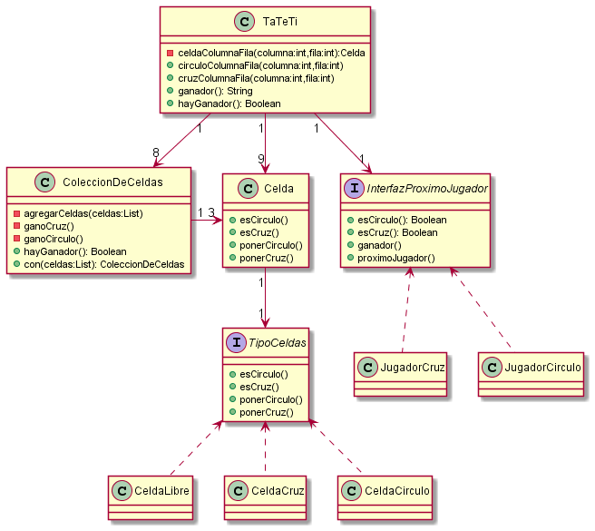
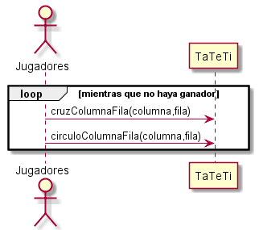
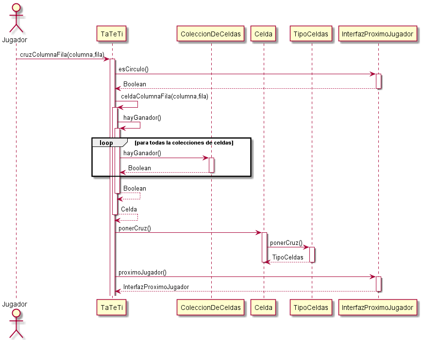

# Parcial Tema 2 - 22/06/2021

## Parte 1

### a)

### b)

## Parte 2

### a) Explique qué es una refactorización, y qué se busca con la práctica de refactoring

### b) Relate las 3 refactorizaciones que haría en los 3 casos de código repetido mencionados más arriba, usando código o diagramas para mostrarlas

### c) ¿Qué hace que una refactorización sea tal y no otro tipo de cambio de código? ¿Cómo puede garantizar esto?