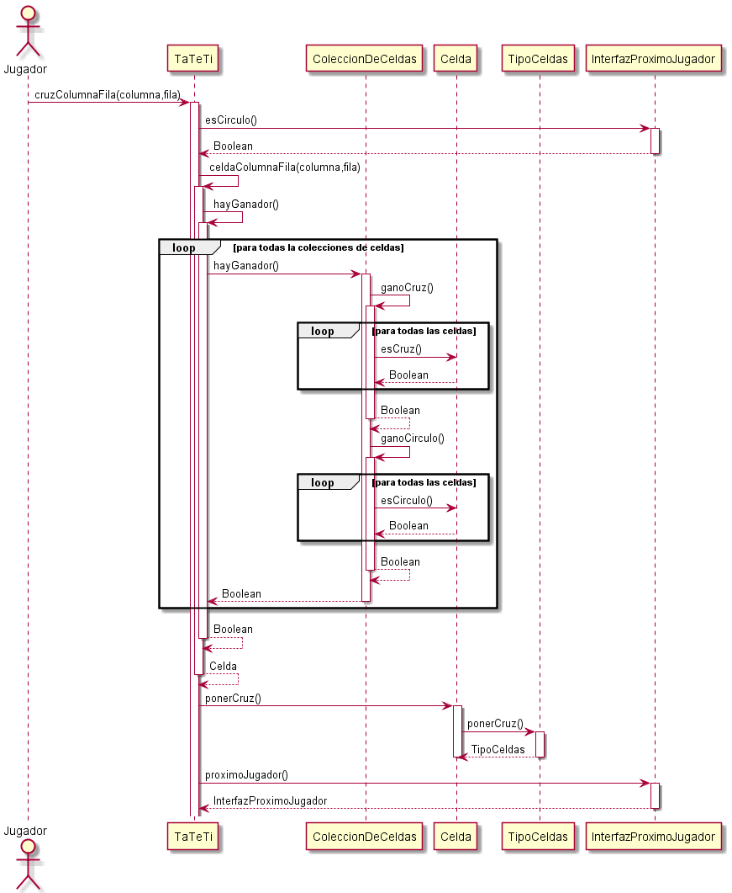

# Parcial Tema 2 - 22/06/2021

## Parte 1

### a)


### b)




### **Correccion**

```txt
Me parecen innecesarias las excepciones de tieneQueJugarX, por como tenes planteado el modelo podrias hacer que jueguen los jugadores entonces ya sabes que van a jugar correctamente

Idem con los metodos cruzColumnaFila y circuloColumnaFila, podrias delegarle al jugador un metodo jugarColumnaFila y cada uno sabe si poner cruz o circulo
Es incorrecta la excepcion si el juego no se termino.

Cuidado con los metodos esCirculo, esCruz --> estas preguntandole la clase a los objetos
```

esa es mi devolucion, con respecto al ultimo punto: me parece que es medio fulero hacer eso, pero tampoco veo la forma de eliminarlo. Igualmente tene cuidado con eso que no es muy buena practica

## Parte 2

### a) Explique qué es una refactorización, y qué se busca con la práctica de refactoring

### b) Relate las 3 refactorizaciones que haría en los 3 casos de código repetido mencionados más arriba, usando código o diagramas para mostrarlas

### c) ¿Qué hace que una refactorización sea tal y no otro tipo de cambio de código? ¿Cómo puede garantizar esto?