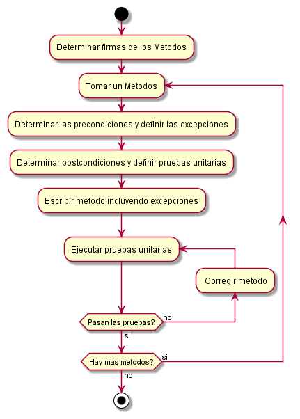
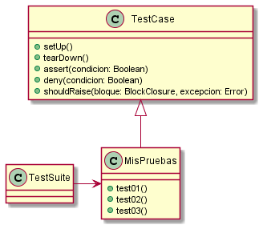
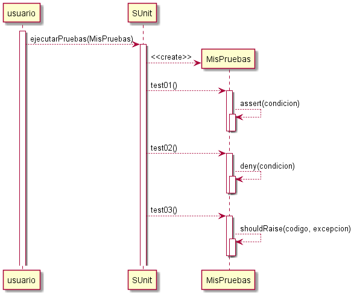
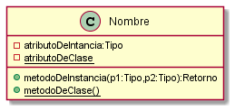
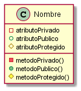

# **Programacion Orientada a Objetos**

- [**Programacion Orientada a Objetos**](#programacion-orientada-a-objetos)
  - [**Bloques de construcción de POO**](#bloques-de-construcción-de-poo)
    - [**Clases**](#clases)
      - [**Relaciones entre clases:**](#relaciones-entre-clases)
        - [**Herencia:**](#herencia)
        - [**Clases Abstractas:**](#clases-abstractas)
        - [**Metodo Abstracto:**](#metodo-abstracto)
    - [**Objetos**](#objetos)
      - [**Relaciones entre Objetos:**](#relaciones-entre-objetos)
        - [**Dendencia y Asociacion:**](#dendencia-y-asociacion)
    - [**Mensajes**](#mensajes)
    - [**Encapsulamiento:**](#encapsulamiento)
      - [**Tell, dont ask**](#tell-dont-ask)
      - [**Visibilidad**](#visibilidad)
  - [**Diseño por Contrato**](#diseño-por-contrato)
    - [**Firmas de Metodos**](#firmas-de-metodos)
    - [**Precondiciones**](#precondiciones)
      - [**Excepciones**](#excepciones)
    - [**Postcondiciones**](#postcondiciones)
    - [**Invariantes**](#invariantes)
    - [**El procedimiento del diseño por contrato**](#el-procedimiento-del-diseño-por-contrato)
  - [TDD](#tdd)
  - [Diseño orientado a objetos](#diseño-orientado-a-objetos)
    - [Acoplamiento](#acoplamiento)
    - [Cohesión](#cohesión)
    - [**SOLID**](#solid)
      - [**SRP – Single Responsibility Principle**](#srp--single-responsibility-principle)
      - [**OCP – Open/Closed Principle**](#ocp--openclosed-principle)
      - [**LSP – Liskov Substitution Principle**](#lsp--liskov-substitution-principle)
      - [**ISP – Interface Segregation Principle**](#isp--interface-segregation-principle)
      - [**DIP – Dependency Inversion Principle**](#dip--dependency-inversion-principle)
    - [**Cuando un diseño es malo**](#cuando-un-diseño-es-malo)
      - [**Code Smells**](#code-smells)
  - [**Implementacion de POO en Java y Smalltalk**](#implementacion-de-poo-en-java-y-smalltalk)
    - [**Implementacion de Testing**](#implementacion-de-testing)
      - [**SUnit**](#sunit)
  - [**UML**](#uml)
    - [**Driagrama de Clase**](#driagrama-de-clase)
      - [**Flechas UML**](#flechas-uml)
      - [**Visibilidad UML**](#visibilidad-uml)
      - [**Interfaces, Clases y Metodos Abtractos UML**](#interfaces-clases-y-metodos-abtractos-uml)
      - [**Notas y estereotipos**](#notas-y-estereotipos)
      - [**Multiplicidad UML**](#multiplicidad-uml)
    - [**Diagrama de Secuencia**](#diagrama-de-secuencia)
      - [**Actores y Participantes**](#actores-y-participantes)
      - [**Activacion, creacion y destruccion**](#activacion-creacion-y-destruccion)
      - [**Notas Diagramas de Secuencia**](#notas-diagramas-de-secuencia)
      - [**Alts y Loops**](#alts-y-loops)

La programación orientada a objetos (POO) es un paradigma de programación que se basa en el concepto de clases y objetos . Se utiliza para estructurar un programa de software en piezas simples y reutilizables de planos de código (generalmente llamadas clases), que se utilizan para crear instancias individuales de objetos los cuales envian y reciven mensajes.

La POO plantea los siguientes 3 pasos para resolver un problema:

1. Encontrar objetos.
    1. Seria encontrar las entidades del domino, una buena idea es empezar por los sustantivos que surgen del propio enunciado del problema  
2. Determinar cómo deben interactuar los objetos.
3. Implementar el comportamiento de los objetos.

## **Bloques de construcción de POO**

### **Clases**

Una clase es una especie de "plantilla" en la que se definen los atributos y métodos predeterminados de un tipo de objeto.

- **Metodo:** Llamamos método a la implementación de la respuesta de un objeto a un mensaje.
- **Atributo:** variable interna del objeto que sirve para almacenar parte del estado del mismo.

#### **Relaciones entre clases:**

##### **Herencia:**

La herencia es una relación entre clases, por la cual se define que una clase puede ser un caso particular de otra. A la clase más general la llamamos madre y a la más patricular hija. Cuando hay herencia, todas las instancias de la clase hija son también instancias de la clase madre.

- **Programamos por diferencia:** cuando indicamos que parte de la implementación de un objeto está definida en otro objeto, y por lo tanto sólo implementamos las diferencias específicas.
- **Redefinicion:** Los lenguajes de programación que tienen clases y herencia, permiten volver a definir métodos que ya estuvieran definidos en la clase base en sus clases derivadas
  - La redefinición existe para definir un mismo comportamiento en una clase derivada, para el mismo mensaje de la clase base. Por lo tanto, la semántica o significado del mensaje se debe mantener. Si así no fuera, conviene definir un método diferente, con nombre diferente.

##### **Clases Abstractas:**

Una clase es abstracta cuando no puede tener instancias en forma directa, habitualmente debido a que sus clases descendientes cubren todos los casos posibles.

Cuando queramos indicar una clase que no es abstracta (que puede tener instancias) la llamaremos clase concreta.

##### **Metodo Abstracto:**

Un método es abstracto cuando no lo implementamos en una clase, pero sí deseamos que todas las clases descendientes puedan entender el mensaje.

Cuando queramos indicar un método que no es abstracto (que tiene implementación) lo llamaremos método concreto.

### **Objetos**

Una entidad que existe en tiempo de ejecución y que tiene comportamiento. Son capaces de recibir y mandar mensajes.

Los objetos tienen:

- **Identidad:** es lo que distingue un objeto de otro.
- **Estado:** la situacion en que se encuntra un objeto. El estado de un objeto puede cambiar a traves del tiempo.
  - Los cambios de estado suelen ser por un mensaje recibido por el objeto
  - Generalmente privado, o salvo que se necesite que se pueda mediante un mensaje
- **Comportamiento:** El comportamiento de un objeto está compuesto por las respuestas a los mensajes que recibe un objeto, que a su vez pueden provocar:
  - Un cambio de estado en el objeto receptor del mensaje.
  - La devolución del estado de un objeto, en su totalidad o parcialmente.
  - El envío de un mensaje desde el objeto receptor a otro objeto (delegación).

#### **Relaciones entre Objetos:**

##### **Dendencia y Asociacion:**

Un objeto depende de otro cuando debe conocerlo para poder enviarle un mensaje.Todo objeto cliente depende de su servidor. La dependencia puede venir dada de tres maneras:

- Porque el objeto servidor se envía como argumento.
- Porque el objeto servidor se obtiene como respuesta al envío de un mensaje a otro objeto.
- Porque el objeto cliente tiene una referencia al servidor.

La asociacion es una forma de dependencia en la que el objeto cliente tiene almacenada una referencia al objeto servidor.

### **Mensajes**

Un mensaje es la interacción entre un objeto que pide un servicio y otro que lo brinda.

- El objeto que envía el mensaje se llama **objeto cliente** y quien recibe el mensaje se llama **objeto receptor**.
- **Delegacion:** Cuando un objeto, para responder un mensaje, envía mensajesa otros objetos, decimos que delega ese comportamiento en otros objetos.

### **Encapsulamiento:**

Cada objeto es responsable de responder a los mensajes que recibe, sin que quien le envía el mensaje tenga que saber cómo lo hace. Esto es lo que llamamos encapsulamiento.

Las razones de ser del encapsulamiento son varias, entre ellas:

- Puede haber implementaciones alternativas para una misma operación.
- En el futuro, podemos cambiar una implementación por otra, ambas correctas, sin afectar al cliente que utiliza el servicio.

#### **Tell, dont ask**

Un colorario del encapsulamiento que que implica que los objetos deben manejar su propio comportamiento, sin que nosotros manipulemos su estado desde afuera.

#### **Visibilidad**

Los lenguajes de programación orientados a objetos prevén distintos tipos de visibilidad de los elementos del lenguaje: métodos, atributos y clases. Habitualmente hay tres niveles de visibilidad:

- **Pública:** el método, atributo o clase en cuestión se puede utilizar en cualquier parte del programa.
- **Privada:** el método, atributo o clase en cuestión se puede utilizar solamente dentro de su clase.
- **Protegida:** el método, atributo o clase en cuestión se puede utilizar solamente dentro desu clase o una clase descendiente de ella.

Un buen manejo de la visibilidad permite que el programador haga una buena administración del encapsulamiento, dando visibilidad solamente a aquellos elementos que necesitan ser usados desde afuera.

## **Diseño por Contrato**

La idea primigenia del diseño por contrato es, entonces, que un objeto servidor brinda servicios a objetos clientes sobre la base de un contrato que ambos se comprometen a cumplir.

Esta formado por cuatro elementos fundamentales:

- firmas de métodos.
- precondiciones.
- postcondiciones.
- invariantes.

### **Firmas de Metodos**

Las firmas de los métodos son las que determinan cómo hacer para pedirles servicios a los objetos.

Al conjunto de las firmas de métodos se lo suele llamar interfaz o protocolo del objeto, porque es lo que permite saber qué servicios expone y cómo dialogar con él. **No confundir con la implementacion de una Interfas**

### **Precondiciones**

Las precondiciones expresan en qué estado debe estar el medio ambiente antes de que un objeto cliente le envíe un mensaje a un receptor.

Si una precondición no se cumple, el que no está cumpliendo el contrato es el cliente. Por lo tanto, el objeto receptor del mensaje, lo único que puede hacer es avisarle de ese incumplimiento al cliente y no seguir con la ejecución del método. Habitualmente, los lenguajes de POO tienen un mecanismo llamado excepciones.

#### **Excepciones**

Una excepción es un objeto que se usa para comunicar una situación excepcional desde un entorno que la detecta al ámbito desde el cual fue invocado.

Notemos que hablamos de excepciones cuando el problema no se puede resolver en un determinado contexto. La idea es que cuando surge una excepción no hay forma de continuar y se debe elevar la misma a un contexto de nivel superior para que resuelva el inconveniente

### **Postcondiciones**

En términos estrictos, el conjunto de postcondiciones expresa el estado en que debe quedar el medio como consecuencia de la ejecución de un método. En términos operativos, es la respuesta ante la recepción del mensaje.

El cumplimiento de las postcondiciones es responsabilidad del receptor. Si una postcondición no se cumple se debe a que el método está mal programado por quien deba implementar el objeto receptor. Por lo tanto, el cumplimiento de una postcondición se debe chequear con una Prueba Unitaria

### **Invariantes**

Los invariantes son condiciones que debe cumplir un objeto durante toda su existencia.

El cumplimiento de los invariantes es responsabilidad de todos los métodos de un objeto, desde su creación. De alguna manera, pueden considerarse precondiciones y postcondiciones de todos los métodos.

En general, suelen expresarse en forma de precondiciones o postcondiciones.

### **El procedimiento del diseño por contrato**



## TDD


## Diseño orientado a objetos

### Acoplamiento

El acoplamiento se refiere al grado de interdependencia que tienen dos unidades de software entre sí, entendiendo por unidades de software: clases, subtipos, métodos, módulos, funciones, bibliotecas, etc.

Si dos unidades de software son completamente independientes la una de la otra, decimos que están desacopladas.

### Cohesión

La cohesión de software es el grado en que elementos diferentes de un sistema permanecen unidos para alcanzar un mejor resultado que si trabajaran por separado. Se refiere a la forma en que podemos agrupar diversas unidades de software para crear una unidad mayor.

### **SOLID**

#### **SRP – Single Responsibility Principle**

> Toda clase debe tener una unica responsibilidad

Este principio fue enunciado por Meilir Page-Jones. Según el mismo, **cada clase debería tener una única responsabilidad.** En general se lo alinea con el tema de cohesión, que implica que cada clase debe corresponder a una única abstracción.

Un corolario importante de este principio es el postulado de que **cada clase tiene que tener una sola razón para cambiar**

#### **OCP – Open/Closed Principle**

> Las Clases deben estar abiertas para las extensiones pero cerradas para su modificacion

El principio abierto-cerrado enunciado por Bertrand Meyer, expresa que las **clases tienen que estar cerradas para modificación, pero abiertas para reutilización.**

Esto es, habría que tratar de no modificar clases existentes, ya probadas, estables y en producción. Pero esto no impide que dichas clases puedan reutilizarse desde otras.

- Se debe poder cambiar el comportamiento sin modificar el codigo ya existente
- Se puede lograr utilizando herencia o delegacion

#### **LSP – Liskov Substitution Principle**

El principio de Sutitucion de Liskov enunciado por Barbara Liskov, plantea que los subtipos deben ser sustituibles en todas partes por sus tipos base. La aplicación más elemental de este principio es el chequeo de la relación **“es un”**

- Las subclases deben poder ser utilizadas a travez de la clase madre sin ningun problema

**Los corolarios del principio de sustitución son:**

- Las precondiciones de un método no pueden ser más estrictas en una subclase de lo que son en su ancestro.
- Las postcondiciones de un método no pueden ser más laxas en una subclase de lo que son en su ancestro.
- Los invariantes de una clase deben ser al menos los mismos de la clase ancestro.
- Un método debe lanzar los mismos tipos de excepciones que en la clase ancestro, o a lo sumo excepciones derivadas de aquéllas.

#### **ISP – Interface Segregation Principle**

> Los clientes no deben ser forzados a depender de metodos que no utilizan

EL principio de segregación de la interfaz pretende que los clientes de una clase no dependan de métodos que no utilizan.

Así, si una clase tiene una referencia a, o hereda de, otra clase, de la cual sólo tiene sentido que utilice algunos de sus métodos, pero no todos, lo mejor sería separar la clase en cuestión en más de una, y colocar en una de ellas los métodos que utilice ese cliente.

#### **DIP – Dependency Inversion Principle**

Se debe depender de las abtracciones y no de las implementaciones

- Los módulos de alto nivel no deberían depender de módulos de bajo nivel. Ambos deberían depender de abstracciones.
- Las abstracciones no deberían depender de los detalles. Los detalles deberían depender de las abstracciones.

El objetivo del principio de Inversión de dependencia consiste en reducir las dependencias entre los módulos del código, es decir, alcanzar un **bajo acoplamiento** de las clases.

### **Cuando un diseño es malo**

- **Rigidez:** dificultad de cambiar, porque cada vez que se modifica algo, esto provoca una secuencia interminable de cambios.
- **Fragilidad:** cada cambio provoca problemas en partes del código que no tienen que ver con el mismo.
- Se hace muy difícil descomponer el sistema en partes reutilizables.
- El ciclo editar-compilar-probar lleva mucho tiempo.
- **Complejidad innecesaria:** estructuras de código que no se necesitan, aunque puedan servir en el futuro.
- **Repetición innecesaria:** no se reutiliza, sino que se ha copiado partes de código en varios lugares.
- **Opacidad:** el programador se expresa – mediante el código – de formas ininteligibles.

#### **Code Smells**

- Ciclos muy anidados, que se deberían convertir en métodos.
- Código duplicado, que causa modificaciones paralelas.
- Métodos complejos o muy largos.
- Clases con varias responsabilidades, o muy grandes.
- Abundancia de sentencias switch o if anidadas.
- Largas secuencias de llamadas sucesivas a métodos.
- Demasiados chequeos de referencias nulas.
- Clases sin comportamiento, que sólo tienen atributos y las propiedades que permiten

## **Implementacion de POO en Java y Smalltalk**

<details><summary><b>Instanciar una Clase:</b></summary>

**En smalltalk:**

```smalltalk
  celda := Celda new.
```

**En Java:**

```java
  Celda celda = new Celda ( );
```

</details></br>

<details><summary><b>Implementacion de Metodos:</b></summary>

**En smalltalk:**

```smalltalk
  estaLibre 
    ^ ( contenido = 0 ) 

```

**En Java:**

```java
  public boolean estaLibre () { 
    return contenido == 0; 
  }
```

</details></br>

<details><summary><b>Implementacion de Herencia:</b></summary>

**En smalltalk:**

```smalltalk
    Error subclass: #ValorInvalido
```

**En Java:**

```java
    class ValorInvalido extends RuntimeException { } 
```

</details></br>

<details><summary><b>Implementacion de Metodos y Clases Abstractas:</b></summary>

**En Java,** la declaración de un método como abstracto que hace añadiendo la palabra abstract en su firma, y cerrando con un punto y coma en vez de un bloque de código. He aquí un ejemplo:

```java
public abstract void extraer (int monto); 
```

Una clase que tiene algún método abstracto debe ser abstracta, por lo que hay que agregar la palabra abstract en su encabezado, como en el ejemplo:

```java
public abstract class Cuenta { 
 … 
}
```

**En Smalltalk,** un método abstracto se implementa enviando un mensaje que implica que las subclases deben implementarlo, como en el ejemplo:

```smalltalk
extraer: monto 
  self subclassResponsibility. 
```

</details></br>

### **Implementacion de Testing**

#### **SUnit**

La idea de SUnit es simple, y se basa en las siguientes premisas:

- Para escribir una clase de pruebas, debemos hacer que la misma derive de la clase TestCase.
- Cada método de prueba debe poder tener cualquier nombre, a condición de que empiece con la palabra test.
- Al escribir cada método, nos podemos ayudar con el comportamiento provisto en TestCase, que incluye algunos métodos de nombres assert, deny, should, etc.
- SUnit se ocupa de que todos los métodos test escritos hasta el momento en una clase derivada de TestCase se puedan ejecutar a la vez.

**Ejemplo:**

Al trabajar con SUnit, lo que debemos hacer es escribir una clase de pruebas, que llamaremos PruebasCuentas, derivada de la clase TestCase.

```smalltalk
    TestCase subclass: #PruebasX
```

**Con todo esto definimos los métodos de la clase PruebasX:**

```smalltalk
    test01SumarUnoMasUnoDaDos
        self assert: (1+1) equals: 2
```

```smalltalk
    test02UnoMasUnoNoDaTres
        self deny: (1+1=3)
```

```smalltalk
    test03DividirPorCeroDebeLanzarExcepcion
        self should: [1/0] raise: ZeroDivide
```

<details><summary><b>Diagrama de como Funciona:</b></summary>





</details>

## **UML**

Usos:

- Discutir el diseño de un sistema
- Documentar el diseño
- Model Driven Development(No muy usado)

### **Driagrama de Clase**

---

Los métodos y los atributos de las instancias de cada clase. En estos casos, cada clase se representa como un rectángulo de 3 compartimientos. El primero es para el nombre de la clase, el segundo es para los atributos y el tercero para los métodos.

- ClassDiagramClaseUML es el nombre que va a recibir el png creado, se pone al lado de `@startuml`

```uml
@startuml ClassDiagramClaseUML
Class Nombre{
  -atributoDeIntancia:Tipo
  -{static}atributoDeClase
  +metodoDeInstancia(p1:Tipo,p2:Tipo):Retorno
  +{static}metodoDeClase()
}
@enduml
```



- En PlantUML usar `skinparam classAttributeIconSize 0` para que use letras en vez de simbolos

#### **Flechas UML**

|Relacion|UML|Situacion|
|--------|---|------------------|
|Dependencia| ..>  | Una clase obtiene información de otra |
|Asociacion| -->  |Cada instancia de una clase contiene una relación con una instancia de la otra |
|Agregacion| o--  | Las instancias de una clase son partes de una instancia de otra  |
|Composicion| *--  |Las instancias de una clase están contenidas en una instancia de otra |
|Herencia| <\|-- | Cumple "es un" |
|Impl. de Interfaz| ..\|>  | |

#### **Visibilidad UML**

| Signo | Significado |
|-------|-------------|
|+| Visibilidad Publica |
|-| Visibilidad Privada |
|#| Visibilidad Protegida |
|~| Visibilidad de Paquete |

```uml
@startuml ClassDiagramVisibilidadUML
Class Nombre{
    -atributoPrivado
    +atributoPublico
    #atributoProtegido
    -metodoPrivado()
    +metodoPublico()
    #metodoProtegido()
}
@enduml
```



#### **Interfaces, Clases y Metodos Abtractos UML**

Las clases y métodos abstractos se escriben en cursiva. Hay personas que en vez de escribir las clases abstractas en cursiva.

```uml
@startuml
Class ClaseConcreta{
  + metodoConcreto()
}

Abstract Class ClaseAbstracta{
  + {Abstract}metodoAbstracto()
}

Interface Interface <<Interface>>{
  +metodo()
}

Interface <|.. ClaseAbstracta
ClaseAbstracta <|-- ClaseConcreta
@enduml
```


#### **Notas y estereotipos**

```UML
@startuml
class Object << general >>
Object <|--- ArrayList

note top of Object : In java, every class\nextends this one.

note "This is a floating note" as N1
note "This note is connected\nto several objects." as N2
Object .. N2
N2 .. ArrayList

class Foo
note left: Nota a la ultima clase

class A {
{static} int contador
+void {abstract} inicio()
}

note right of A::contador
  Nota a Atributo
end note
note right of A::inicio
  Nota a un metodo
end note
@enduml
```


#### **Multiplicidad UML**

|Multiplicidad|Significado|
|-|-|
|1|Uno y solo uno|
|0..1|Cero o Uno|
|n..m|Desde **n** hasta **m**|
|*|Cero o Varios|
|0..*|Cero o Varios|
|1..*|Uno o Varios|

### **Diagrama de Secuencia**

---

```UML
@startuml
header Encabezado
footer Page %page% of %lastpage%

title Titulo

Alice -> Bob: mensaje(parametro: tipo)
Bob --> Alice: retorno: tipo

Alice -> Bob: otro mensaje
Alice <-- Bob: otro retorno
@enduml
```


#### **Actores y Participantes**

```UML
@startuml
Actor X as "Jugador"
Participant Y as "Alice"
Participant Z as "Bob"

X -> Y: mensaje de actor

Y -> Z: mensaje
Z --> Y: retorno

Y -> Z: otro mensaje
Y <-- Z: otro retorno

Y -> Y: mensaje a si mismo
@enduml
```


#### **Activacion, creacion y destruccion**

```UML
@startuml
Actor X as "Jugador"
Participant Y as "Alice"
Participant Z as "Bob"

X -> Y: mensaje de actor
activate Y
create Z
Y -> Z: mensaje
activate Z
Z --> Y: retorno
destroy Z
Y -> Y: mensaje a si mismo
activate Y
Y --> Y: retorno a si mismo
deactivate Y
Y --> X
deactivate Y
@enduml
```


#### **Notas Diagramas de Secuencia**

```uml
@startuml
participant Alice
participant Bob

Alice->Bob
note left: Nota a la izquierda del ultimo mensaje
note right: Nota a la derecha del ultimo mensaje

note left of Alice 
  Nota larga
  a la izquierda de Alice
end note

note right of Alice: Nota a la derecha de Alice

note over Alice: Nota sobre Alice.


note over Bob, Alice
  Nota sobre ambos
  Larga
end note
@enduml
```


#### **Alts y Loops**

```uml
@startuml
Alice -> Bob: mensaje

alt un caso
    Bob --> Alice: retornoCaso1
else otro caso
    Bob --> Alice: retornoCaso2
end

loop por x veces
    Alice->Bob: mensajeEnLoop
end
@enduml
```


